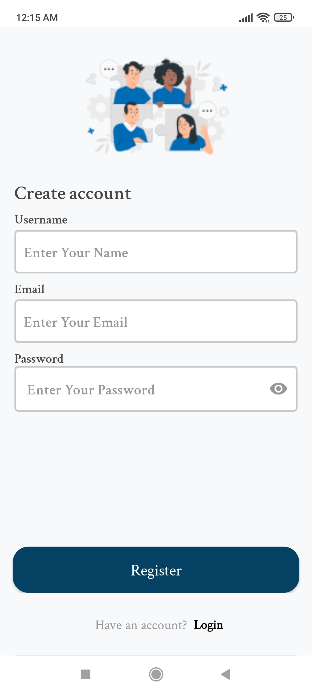
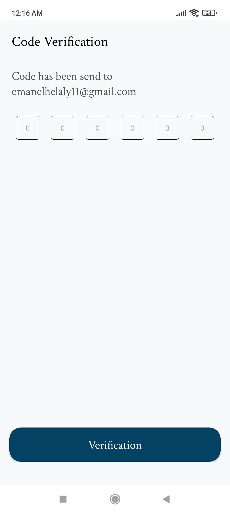
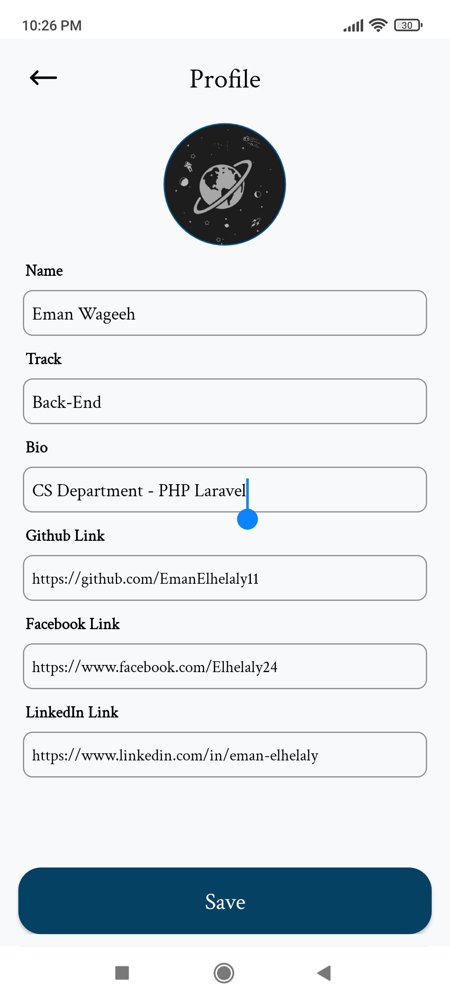
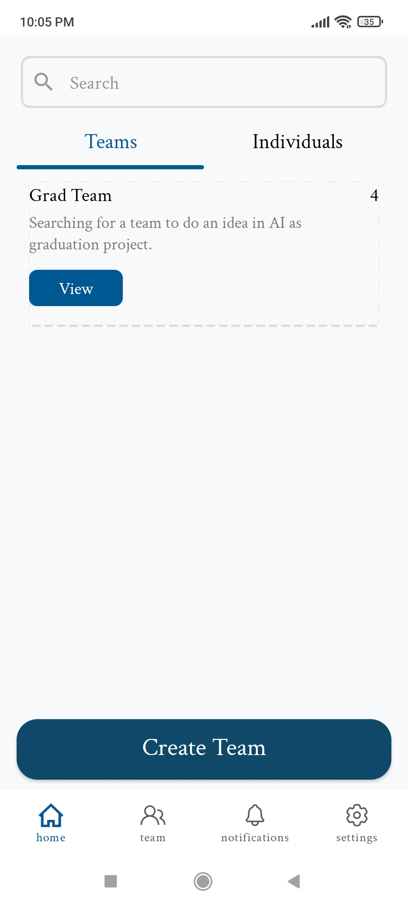
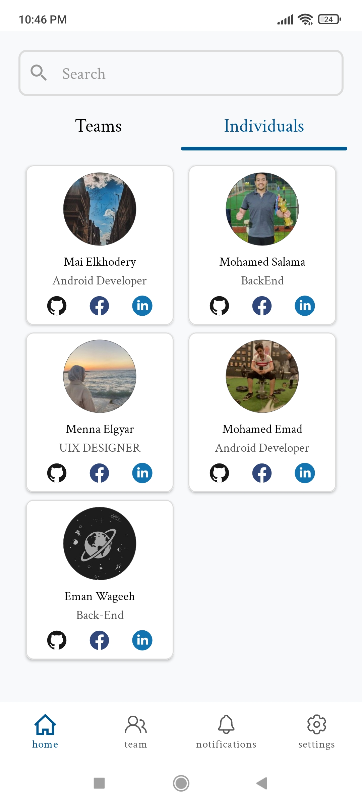
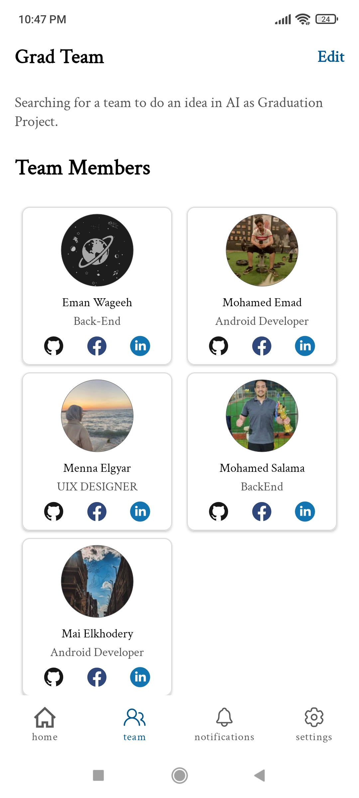
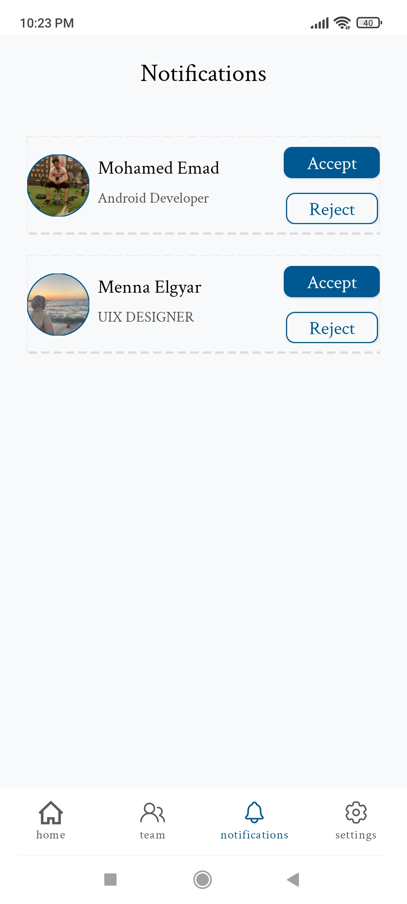

<p align="center"><a href="https://laravel.com" target="_blank"></a></p>


# TeamUpGrad


## Description
TeamUpGrad app is designed to assist students in finding suitable team members for their graduation projects.
               
## Implemented Features
- User can sign up, verify his email, log in and log out
- User can update his profile
- Home screen to view and search for all teams and users 
- User can create team (Team Leader)
- Team leader can edit team, delete team, and remove member
- Users can request to join a team
- Team leader can accept or reject the join request
- Notifications Screen


## Screenshots

|      Splash     |       Sign up         |          Verification            | Update Profile
|:--------------------------:|:--------------------------:|:--------------------------:|:--------------------------:|
|  |  |  |   |

|            Home            |     Individuals |   Team        | Notifications |
|:--------------------------:|:--------------------------:|:------------:|:--------------------------:|
|  |  |  |   |


## Installation

1- Clone the project

```bash
  git clone https://github.com/EmanElhelaly11/TeamUpGrad.git
```

2- Set up the configuration

1. Rename `.env.example` to `.env`.

2. Create a new database in your local database management system (e.g., phpMyAdmin).

3. Update the `DB_DATABASE` value in `.env` with the name of the database you created. For example: `DB_DATABASE=teamupgrad`


3- Install dependencies

```bash
  composer install
  php artisan key:generate
```
4- Run database migrations

```bash
  php artisan migrate 
  php artisan migrate:fresh
```

5- Launch the application

```bash
  php artisan serve 
```

## Contributors

### Android Developers
- Mohamed Emad: [GitHub Profile](https://github.com/Mohamed02Emad)
- Mai Elkhodery: [GitHub Profile](https://github.com/maielkhodery)

### Backend Developers
- Mohamed Salama: [GitHub Profile](https://github.com/MohamadSalamaMouse)
- Eman Elhelaly: [GitHub Profile](https://github.com/EmanElhelaly11)

### UI/UX Designer
- Menna Elgayar: [GitHub Profile](https://github.com/MennaElgyar)
- 
## Android Code
(https://github.com/Mohamed02Emad/TeamUpGrad)

